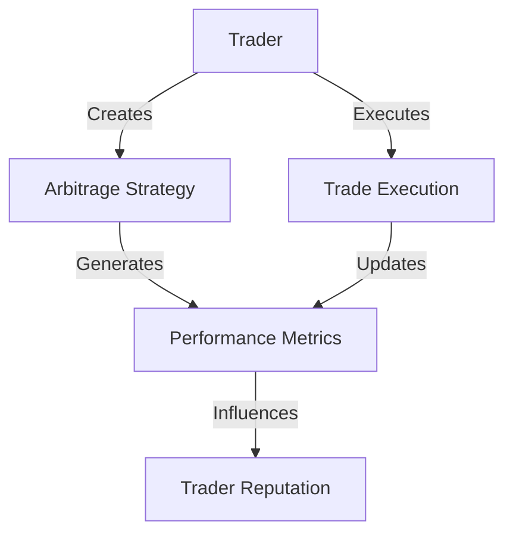

# Arbitrage Serialize 🔄💱

A decentralized platform for tracking, executing, and optimizing cross-chain arbitrage strategies on the Stacks blockchain.

## Overview

Arbitrage Serialize is an innovative smart contract that enables traders to create, manage, and execute sophisticated cross-chain arbitrage strategies with transparent tracking and performance metrics.

### Key Features

- Create custom arbitrage strategies across different blockchain networks
- Track strategy performance with real-time metrics
- Monitor trader reputation and success rates
- Support for low, medium, and high-risk trading frequencies
- Comprehensive execution logging
- Reputation-based strategy management

## Architecture



### Core Components

1. **Arbitrage Strategies**: Configurable trading configurations
2. **Trader Profiles**: Performance and reputation tracking
3. **Execution Tracking**: Detailed trade logging
4. **Strategy Performance Metrics**: Success rate and profitability analysis

## Contract Documentation

### Strategy Management

#### Create Arbitrage Strategy

```clarity
(create-arbitrage-strategy
  name: string-ascii
  description: string-utf8
  source-chain: string-ascii
  destination-chain: string-ascii
  frequency: uint
  risk-level: uint
  max-allocation: uint) -> (response uint uint)
```

#### Execute Strategy

```clarity
(execute-arbitrage-strategy
  strategy-id: uint
  profit: uint
  details: string-utf8) -> (response uint uint)
```

## Getting Started

### Prerequisites

- Clarinet
- Stacks Wallet
- Basic understanding of Clarity and cross-chain dynamics

### Installation

1. Clone the repository
2. Install dependencies with Clarinet
3. Deploy contract to local Clarinet chain or testnet

### Basic Usage

1. Create an arbitrage strategy:
```clarity
(contract-call? .arbitrage-tracker create-arbitrage-strategy 
  "Eth-Btc Cross-Chain" 
  "Low-risk arbitrage between Ethereum and Bitcoin" 
  "ethereum" 
  "bitcoin" 
  u2 u1 u1000)
```

2. Execute a strategy:
```clarity
(contract-call? .arbitrage-tracker execute-arbitrage-strategy u1 u500 "Successful cross-chain trade")
```

## Development

### Testing

Run tests using Clarinet:
```bash
clarinet test
```

### Local Development

1. Start local Clarinet console:
```bash
clarinet console
```

2. Deploy contract:
```bash
(contract-call? .arbitrage-tracker ...)
```

## Security Considerations

### Limitations

- Strategy execution relies on self-reporting
- Cross-chain arbitrage involves inherent market risks
- Performance metrics are based on reported trades

### Best Practices

- Verify transaction success
- Monitor strategy performance
- Consider gas costs
- Manage risk levels carefully
- Keep private keys secure

## Contributing

Contributions are welcome! Please submit pull requests or open issues to improve the platform.

## License

[Insert appropriate open-source license]